# 1）项目设计部分：

### （1）项目总体构成

​		modules 数据库连接

​		public      css与JavaScript样式

​		routes     数据库接口操作

​		views       前端界面

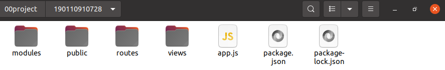

### （2）项目目录结构和各个部分的说明。

#### 		modules:

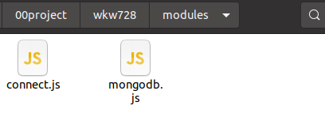

connect.js:数据库连接

mongodb.js:数据库建表

#### 		public:

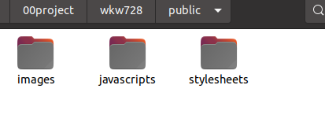

images:图片

javascripts:js样式

stylesheets:bootstrap等样式

#### 		routes:

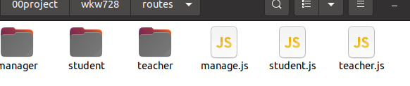

数据库接口操作文件

#### 		views:

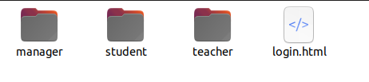

manager:管理员前端界面

student:学生前端界面

teacher:教师前端界面

login.html:登录界面

# 2）使用说明书：

#### 每个功能的使用方法。

1.登录

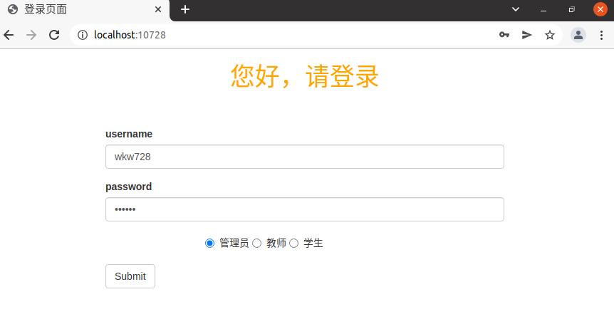

2.管理员界面

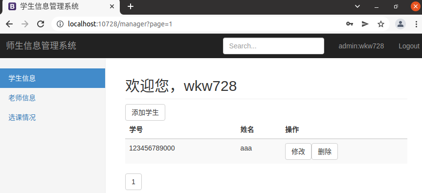

3.添加学生

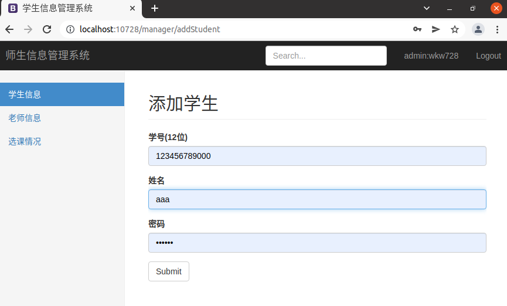

4.添加老师

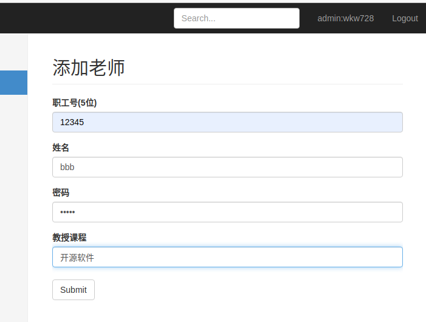

5.学生界面

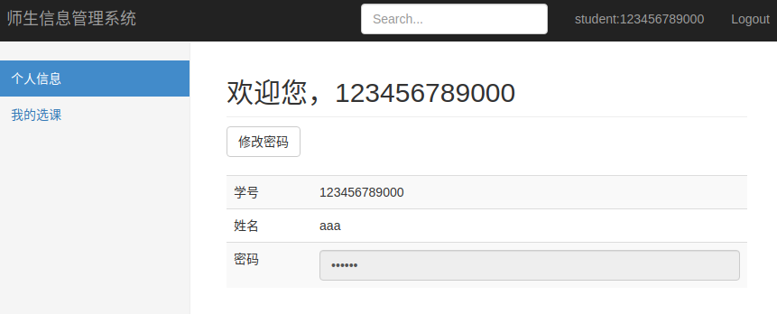

6.修改信息

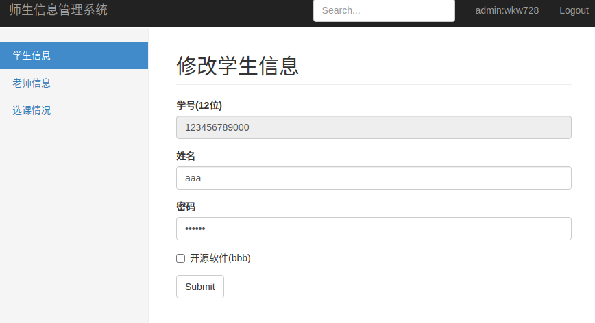

7.学生选课

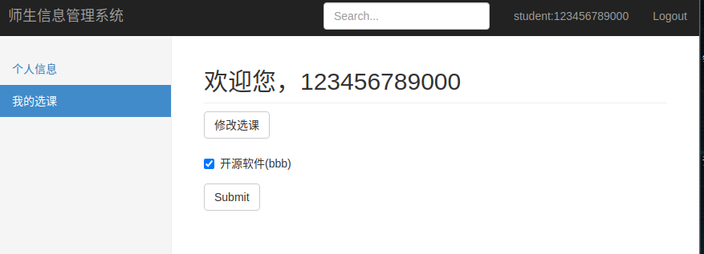

8.查看选课

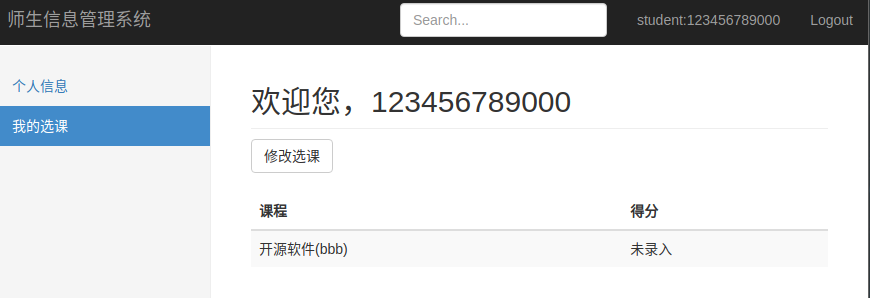

9.教师界面

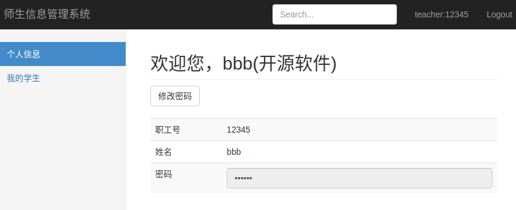

10.教师查看界面

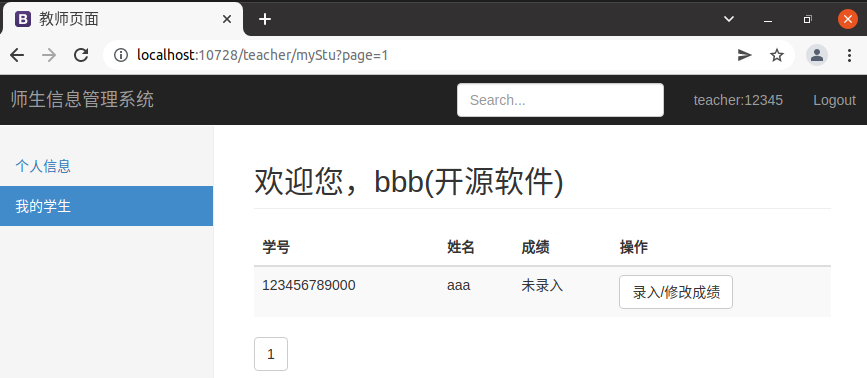

11.成绩录入

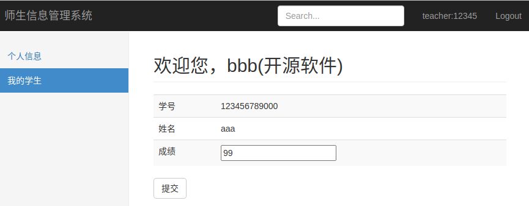

# 3）开发日记（与commit对应）

### （1）first commit

​		manager界面

​		部分前端所需css样式，JavaScript文件

### （2）second commit

​		student界面

### （3）third commit

​		teacher界面

### （4）fourth commit

​		MongoDB数据库文件

###     (5)fifth commit

​		管理员数据库接口文件

###     (6)sixth commit

​		学生教师数据库接口文件	

